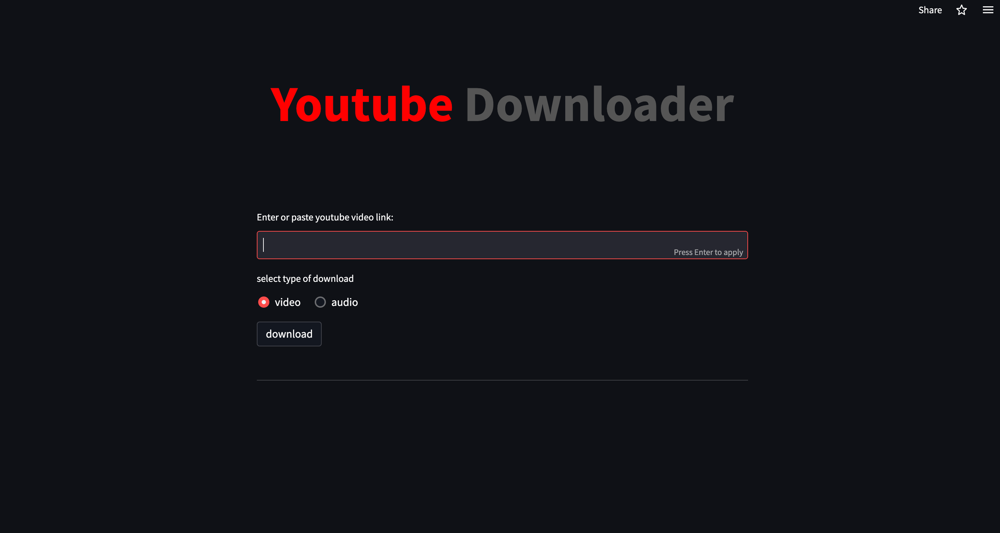

# Youtube Video Downloader

<br>

## App Overview

streamlit web app that takes a youtube link and downloads a video or audio file based on user preference.

<br>

## Packages

```python

pandas==1.5.2
pytube==12.1.2
streamlit==1.16.0

```

<br><i>App Demo</i>

<br>


## Setup and Running App

- install required packages `pip3 install -r requirements.txt`
- Run app locally {port:8501} by default, `streamlit run app.py`

